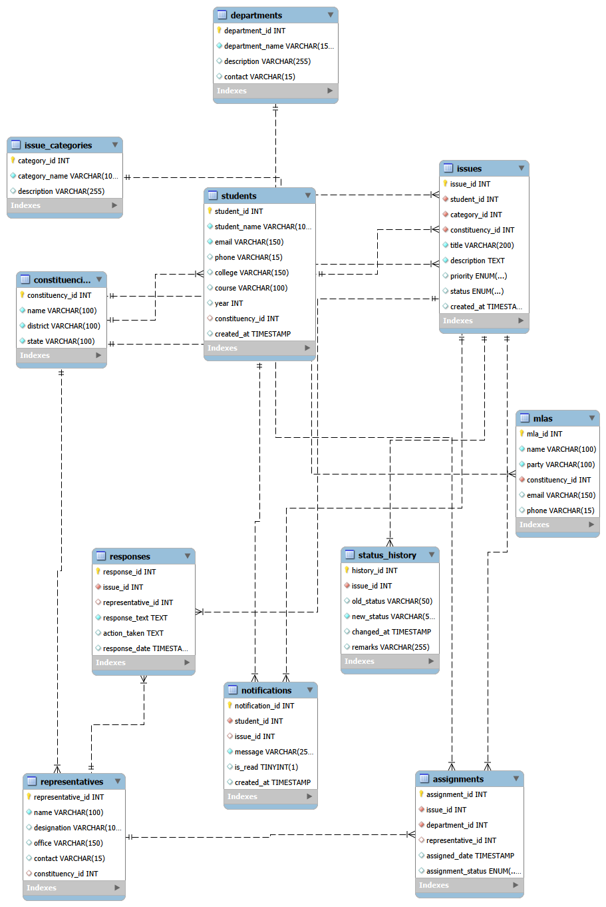

# CivicConnect – Student Civic & Public Grievance Management System

## 📌 Project Overview

CivicConnect is a DBMS-based system designed to manage student and public civic grievances efficiently. It allows users to submit issues, track their status, and manage responses through a structured relational database.

## 🎯 Objectives

- Manage student and civic grievances
- Store user and representative information
- Track issue status and responses
- Maintain organized relational data
- Demonstrate DBMS concepts using MySQL

## 🗄️ Database

**MySQL**

The project contains multiple related tables connected using primary keys and foreign keys.

## 🛠️ Technologies Used

- MySQL
- Python
- HTML5
- CSS3
- JavaScript

## 📊 ER Diagram

## 📄 Project Report

[View / Download DBMS Project Report](./CivicConnect_DBMS_Project_Report.pdf)

## 👨‍💻 Project Repository

[GitHub Repository](https://github.com/avi-ally/CivicConnect-DBMS-Project)

